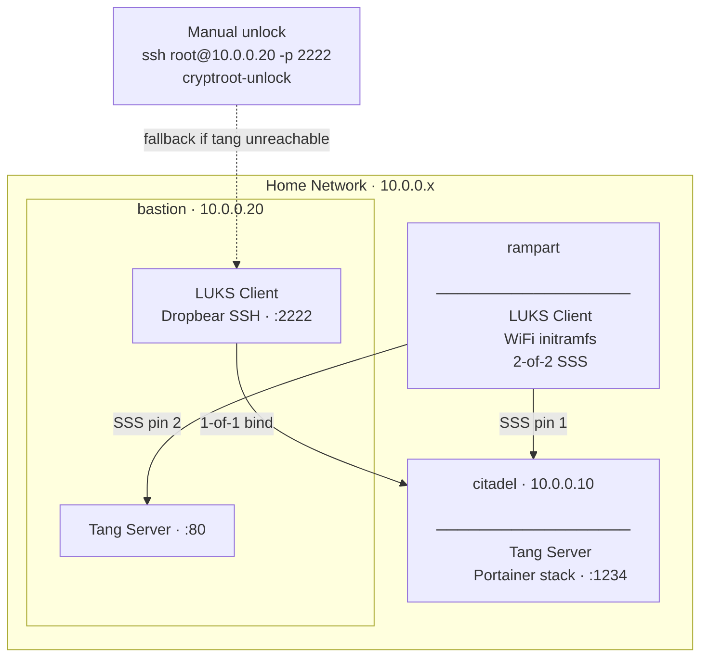

# Network-Bound Disk Encryption with Tang & Clevis

This guide explains how to set up **NBDE** (Network-Bound Disk Encryption) using **Tang** and
**Clevis** — tools that let a LUKS-encrypted machine unlock its disk automatically at boot as
long as it can reach the right servers on your network, with no one typing a passphrase.

---

## What is NBDE?

When a server has full-disk encryption (LUKS), someone normally has to type a passphrase every
time it reboots. This is secure, but it's a problem for unattended machines: a server in a rack,
a NAS, or a machine that reboots after a power outage will sit at a passphrase prompt indefinitely
until a human intervenes.

**Network-Bound Disk Encryption** solves this by making the unlock secret dependent on the
*network environment* rather than a human. The machine can unlock itself automatically when it
boots on your trusted network — but the disk stays encrypted and inaccessible if the machine is
stolen or booted somewhere else.

---

## How Tang & Clevis Work

**Tang** is a simple server that holds a cryptographic key. It responds to requests and helps a
client derive a secret — but it never actually transmits the secret directly. It uses a
mathematical protocol (JOSE/ECIES) so that:

- Tang never learns the LUKS passphrase
- A network observer can't reconstruct the key from the exchange
- If Tang is unreachable, the disk simply can't auto-unlock

**Clevis** is the client-side counterpart. During setup, it binds a LUKS key slot to a Tang
server's public key. At boot, Clevis contacts Tang, performs the key exchange, reconstructs the
LUKS decryption key, and unlocks the disk — all before the OS starts.

**Shamir's Secret Sharing (SSS)** lets you require *multiple* Tang servers to cooperate for
unlock. With a 2-of-2 configuration, *both* servers must be reachable. With 2-of-3, *any two*
of three servers suffice. This gives you flexibility between security (more servers required) and
resilience (fewer servers required).

---

## Architecture

### Key relationships

| Client | Tang servers used | Threshold | Unlock method |
|---|---|---|---|
| bastion | citadel only | 1-of-1 | Clevis auto-unlock (or Dropbear SSH fallback) |
| rampart | citadel + bastion | 2-of-2 | Clevis auto-unlock via WiFi |

Bastion cannot bind to its own Tang server — a machine cannot rely on itself for its own boot
secret. So it binds to citadel alone (1-of-1). If citadel is unreachable, bastion falls back to
its Dropbear SSH listener, where you can SSH in and type the passphrase manually.

Rampart requires both Tang servers (2-of-2 SSS). If either server is unreachable at boot, it
will fall back to prompting for the LUKS passphrase.

---

## Server Inventory

| Host | IP | Tang URL | LUKS encrypted | Unlock method |
|---|---|---|---|---|
| citadel | 10.0.0.10 | `http://10.0.0.10:1234` | — | n/a |
| bastion | 10.0.0.20 | `http://10.0.0.20` | Yes | Clevis → citadel, or Dropbear SSH |
| rampart | DHCP (WiFi) | — | Yes | Clevis → citadel + bastion (2-of-2 SSS) |

---

## Setup Order

Dependencies flow downward: citadel's Tang must be running before any client can bind to it,
and bastion's Tang must be running before rampart can bind to it.

1. **[citadel](docs/citadel.md)** — Deploy the Tang container via Portainer
2. **[bastion](docs/bastion.md)** — Set up bastion's Tang server, then bind it as a LUKS client
3. **[rampart](docs/rampart.md)** — Configure WiFi initramfs, then bind with 2-of-2 SSS

---

## Per-Machine Guides

- [citadel — Tang server (Portainer stack)](docs/citadel.md)
- [bastion — Tang server + LUKS client (Dropbear SSH unlock)](docs/bastion.md)
- [rampart — LUKS client (WiFi initramfs + 2-of-2 SSS)](docs/rampart.md)
- [Key rotation, header backup & recovery](docs/recovery.md)

---

## Scripts

The `scripts/` directory contains helper scripts referenced by the per-machine guides:

| Script | Purpose |
|---|---|
| [`scripts/bastion-clevis-bind.sh`](scripts/bastion-clevis-bind.sh) | Bind bastion's LUKS to citadel tang (1-of-1) |
| [`scripts/rampart-clevis-bind.sh`](scripts/rampart-clevis-bind.sh) | Bind rampart's LUKS to citadel + bastion tang (2-of-2 SSS) |
| [`scripts/wifi-hook`](scripts/wifi-hook) | initramfs hook — bundles WiFi tooling into the image |
| [`scripts/wifi-premount`](scripts/wifi-premount) | initramfs premount — brings WiFi up before clevis runs |
